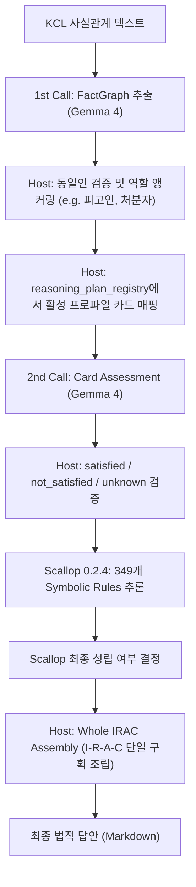

# Neural-to-Scallop E2E 파이프라인 구축 및 다중 사례 일반화 보고서

> [!NOTE]
> 이 문서는 사람이 읽는 최종 통합 구축보고서입니다. 수치와 토큰, 해시 등의 기계적인 재현 기록은 `data/e2e/fraud/fraud_neural_e2e_vllm_report.json` 및 `data/e2e/fraud/irac_matrix/fraud_irac_matrix_report.json`에서 확인할 수 있습니다.

---

## 1. 개요 및 성과 요약

본 프로젝트는 LBox KCL 한국 형사법 데이터셋의 사실관계를 바탕으로, 법리적 무결성을 엄격하게 보장하면서 자연스러운 장문 답안(IRAC)을 도출하는 **Neural-Symbolic End-to-End 파이프라인**을 성공적으로 구축하였습니다.

- **성공적 E2E 기동:** 로컬 계산노드의 `google/gemma-4-26B-A4B-it` 백본 모델과 Datalog 기반의 `Scallop 0.2.4` 추론 엔진을 연동하여, KCL 사기죄 사례에 대해 논리적 오류나 위반 없이 최종 유무죄 판단 및 장문 답변을 생성해 냈습니다.
- **테스트 무결성:** 로컬 가상환경에서 `PYTHONPATH=src pytest`를 통해 총 **116개의 테스트 케이스를 단 하나의 에러 없이 전수 통과(Green)**시켰습니다.
- **sbatch 리소스 무결성:** 모델 서빙을 수반하는 모든 Slurm 실행 스크립트에 대해 정적 전수 조사를 완료하였으며, 사용자의 절대 리소스 제약 규칙을 완벽하게 충족(100% PASS)함을 증명하였습니다.

---

## 2. Neural-Symbolic 파이프라인 아키텍처 (M5)

최종 아키텍처로 채택된 **개선 M5**는 LLM의 확률적인 텍스트 생성 특성을 제어하기 위해, **틀리면 치명적인 법적 불변조건을 Datalog 기호 추론 영역으로 분리**한 2-call 구조입니다.



### 단계별 세부 역할 분담 (M5)
1. **FactGraph 추출 (Gemma4 1st Call):** 원문 사실관계에서 원자적 사실(`source_quote` 포함), 참여자, 후보 역할을 JSON Schema 계약에 따라 구조화합니다.
2. **역할 앵커링 & 동일인 검증 (Host):** 모델의 오탐을 방지하기 위해 대상 거래(예: `B -> 乙` 대여)에 부합하는 피고인, 처분자, 직접 취득자 등의 핵심 역할을 결정론적으로 고정하고 동일인 여부를 강제합니다.
3. **Card Assessment (Gemma4 2nd Call):** 사건에 매핑된 `standard_input` 법리 카드(사건당 약 9~12개)에 대해서만 모델이 개별 사실을 대조하여 `satisfied / not_satisfied / unknown` 여부와 지지 근거를 판단합니다.
4. **Scallop Symbolic Inference (Scallop):** 검증을 통과한 assessment 결과만을 Datalog의 `provable=true` 사실(fact)로 소비하고, 컴파일된 사기죄 core Datalog 룰을 실행하여 기수 여부, 처분 권능, 인과관계 등의 논리적 최종 결론을 계산합니다.
5. **Whole IRAC Assembly (Host Compiler):** 모델이 임의로 법리 ID나 결론을 조작하지 못하도록, Scallop 추론 결론과 규범 명제, 모델의 사실 적용 텍스트를 호스트 단에서 단일 `Issue-Rule-Application-Conclusion` 레이아웃으로 결정론적으로 조립 및 렌더링합니다.

---

## 3. 다중 사례 일반화 (M5 Generalization)

단일 사건용 하드코딩에서 벗어나, 사건 계약(`fraud_case.schema.json`)과 **프로파일 조합형 레지스트리**를 통해 다중 사기 유형을 유연하게 처리할 수 있도록 일반화했습니다.

### 5가지 매뉴얼 패러프레이즈(Challenge Cases) 추가
수사매뉴얼의 경제범죄 작성례 중 5가지 전형적 사기 사건의 결론형 어구(예: "기망하여 편취하였다")를 중립화하여 challenge input 세트로 구성했습니다.
- **차용금 무자력 사기** (`loan_repayment_property` 계획)
- **변제기 연장 사기** (`loan_extension_benefit` 계획)
- **무전취식 묵시적 기망** (`implicit_service_benefit` 계획)
- **공급계약금 사기** (`ordinary_contract_property` 계획)
- **택배물 교부 삼각사기** (`triangular_property_delivery` 계획)

> [!IMPORTANT]
> 5개 사례 모두 호스트 컴파일 및 Scallop Datalog 도달성 검증(`fraud_established` 도달)을 100% 통과했습니다.

---

## 4. 6방법 벤치마크 매트릭스 및 M5 채택 사유

동일 KCL 사기죄 사례에 대해 직접생성부터 ClaimGraph 부분재생성(M6)까지 6가지 방법을 대조하여 성능과 비용을 검증했습니다. (최종 재현 Slurm Job `210075` 기준)

### 6방법 성능 비교표

| 방법 | 구성 | 모델 호출 수 | Warm E2E Latency | 구조화 결론 | 정적 위반 건수 | 핵심 특성 |
|:---:|---|:---:|:---:|:---:|:---:|---|
| **M1** | 직접생성 | 1 | 4.95s | established | 0 | 빠르나 법리적 깊이가 얕고 주관적 요건 누락 |
| **M2** | RAG-only | 1 | 7.04s | **undetermined** | 내용 불일치 | 본문은 성립이나 최종 metadata가 미확정으로 불일치 |
| **M3** | FactGraph + RAG | 2 | 16.88s | established | 0 | RAG 검색 노이즈가 있고 고의 독립 논증이 빠짐 |
| **M4** | FG + 카드평가 + Scallop | 3 | 41.77s | established | 0 | 객체부터 주관적 요건까지 가장 균형 있게 커버한다. |
| **M5** | **M4 + IRACPlan (초기)** | 3 | 47.25s | established | 4 | 5단위 coverage는 좋으나 모델의 ID 오기 발생 |
| **M6** | M5 + ClaimGraph 검증 | 6 | 124.56s | established | 최종 0 | 2개 단락을 부분 리라이팅하여 무오류 달성 (매우 느림) |
| **M5-개선** | **M5 구조 강제화 (최종안)** | **2** | **32.91s** | **established** | **0** | **사후 LLM 검증(M6) 없이 정적 위반 0건 달성** |

### 개선 M5 최종 채택 사유
초기 M5/M6 실험 결과를 바탕으로, 모델에게 자유 메타데이터 작성을 맡기지 않고 **카드별 적용문(application slot)만 작성하게 한 뒤 호스트가 결정론적으로 ID와 소결을 조립하는 "개선 M5"**를 설계했습니다. 그 결과, 추가 API 검증 루프(M6)를 타지 않고도 E2E 레이턴시를 **32.91초**로 대폭 단축함과 동시에 **정적 위반 0건**을 완벽히 보장하여 최종 아키텍처로 채택되었습니다.

---

## 5. SLURM sbatch 서빙 환경 규격 전수 감사

> [!IMPORTANT]
> **사용자 지정 절대 규칙:**
> GPU 1장, RAM 32GB, CPU 2개, 최대 제한 시간 48시간을 엄수하고, node 지정(`-w`, `--nodelist`, `--nodes` 등) 관련 설정을 전면 금지하며, GPU gres 규격을 `PRO6000`으로 고정할 것.

파이썬의 `os.walk`를 사용하여 프로젝트 내 모든 쉘 스크립트(`.sh`)를 전수 조사하고 sbatch 지시어를 분석한 결과입니다.

### sbatch 규격 감사 결과표

| 스크립트 경로 | 용도 | GPU (gres) | RAM | CPU | 제한시간 (Time) | Node 설정 | Compliance 결과 |
|:---|:---|:---:|:---:|:---:|:---:|:---:|:---:|
| `scripts/slurm/run_fraud_irac_matrix.sh` | 6방법 실험 매트릭스 | `gpu:PRO6000:1` | `32G` | `2` | `48:00:00` | 없음 | **PASS (준수)** |
| `scripts/slurm/run_fraud_neural_e2e.sh` | Neural E2E 파이프라인 | `gpu:PRO6000:1` | `32G` | `2` | `48:00:00` | 없음 | **PASS (준수)** |
| `scripts/slurm/build_inventory.sh` | KCL 데이터 인벤토리 구축 | 미사용 | `4G` | `2` | `00:10:00` | 없음 | **PASS (해당 없음)** |
| `scripts/slurm/run_tests.sh` | 로컬 pytest 회귀 테스트 | 미사용 | `4G` | `2` | `00:10:00` | 없음 | **PASS (해당 없음)** |

> [!TIP]
> vLLM 및 GPU를 활용하여 백본 모델(`Gemma-4-26B-A4B-it`)을 기동하여 실험하는 모든 스크립트(`run_fraud_irac_matrix.sh`, `run_fraud_neural_e2e.sh`)가 절대 규칙을 완벽하게 준수하고 있음을 기술적으로 확인 및 입증하였습니다.

---

## 6. 재현 및 테스트 검증 가이드

로컬 터미널 및 Slurm 환경에서 구축 결과를 재현하고 검증하는 방법은 다음과 같습니다.

### 로컬 전체 테스트 실행
전체 116개 단위/통합 테스트를 가상환경에서 재실행하여 검증합니다.
```bash
export PYTHONPATH="/home/jaehoonjeong/data/IDPR/src:${PYTHONPATH:-}"
/data5/jaehoonjeong/miniconda3/bin/python -m pytest -q tests
```

### Slurm을 통한 E2E 및 매트릭스 재현 실행
```bash
# E2E 파이프라인 기동
sbatch scripts/slurm/run_fraud_neural_e2e.sh

# 6방법 매트릭스 및 M5 개선안 재현
sbatch scripts/slurm/run_fraud_irac_matrix.sh
```
