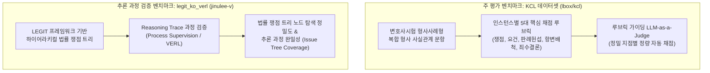

# 4. 실험 환경 및 7대 비교 베이스라인 평가 체계 (Experimental Setup & Baseline Framework)

---

## 4.1. 벤치마크 데이터셋 및 루브릭 기반 평가 체계

본 연구의 성능 및 안전성 검증은 대한민국 형사법 롱폼 법리 추론 벤치마크인 **KCL 데이터셋 (`lbox/kcl`)**과 쟁점 트리 기반 **`jinulee-v/legit_ko_verl` 데이터셋**을 주 평가 기반으로 삼는다.

### 1. 주 평가 벤치마크: **KCL 데이터셋 (`lbox/kcl`)**
- **특징**: 변호사시험 형사사례형 실전 문항 기반의 한국 형사법 롱폼 추론 정식 벤치마크.
- **인스턴스별 5대 핵심 채점 루브릭 (Instance-Level Rubrics)**:
  1. **쟁점 도출 (Issue Identification)**: 사안 내 침입, 절도, 방화, 상해 등 모든 형사 쟁점 적출 여부.
  2. **구성요건 검토 (Substantive Element Analysis)**: 객관적/주관적 요건 단계별 인정 여부.
  3. **판례 적용 및 Exact Citation**: 대법원 판례 번호(`대법원 XXXX도XXXX 판결`) exact 1:1 바인딩.
  4. **위법성·책임 조각 및 항변 배척 (Defense Rejection)**: 불법원인급여, 정당방위 등 배척 검토.
  5. **최종 죄책 및 죄수·경합 판단 (Final Offense & Concurrence Verdict)**: 상상적/실체적 경합 결론.

### 2. 추론 과정 검증 벤치마크: **`jinulee-v/legit_ko_verl` (Jinu Lee)**
- **특징**: LEGIT (Legal Issue Trees) 프레임워크 기반의 쟁점 트리 검증 데이터셋.
- **평가 목적**: Scallop Datalog 심볼릭 엔진이 생성한 **Ground Truth Proof Trace**와 `legit_ko_verl`의 쟁점 트리 노드를 1:1 대조하여, **법률 쟁점 트리 노드 커버리지(Issue Tree Coverage %)** 및 추론 과정의 무누수 완밀성을 검증함.

---

## 4.2. 7대 비교 베이스라인 라인업

1. **Vanilla LLM (Zero-shot 직주입)**: Gemma 4 26B, Llama 3 70B, GPT-4o 단독 파라메트릭 제너레이션.
2. **Chain-of-Thought (CoT) 프롬프팅**: "단계별로 생각하라" (구성요건 ➔ 위법성 ➔ 책임 ➔ 결론) 단계적 가이딩.
3. **Standard RAG (Dense / BM25)**: 동일한 주석서/판례 말뭉치에서 Top-5 컨텍스트를 검색하여 주입.
4. **LegalChainReasoner (ACL 2026 베이스라인)**: 서브-에이전트 법률 추론 체인 모델.
5. **LePREC (ACL 2026 베이스라인)**: 구조화된 요인 분류 후 조건부 제너레이션.
6. **ACAL (ACL 2026 베이스라인)** (`https://github.com/loc110504/ACAL`): 형식 논증 프레임워크 기반 멀티-에이전트 논증 협업 베이스라인.
7. **FOL Autoformalizer + Solver (EMNLP 2025 SOTA)**: First-Order Logic 자동정식화 + SMT/FOL 정리증명기 연동 베이스라인.
8. **본 연구 파이프라인 (OURS)**: 34개 표준 서술어 + Scallop Datalog (3,487개 규범 카드 정률화, 형법 제37조/제40조 범용 수죄론 메타 추론 엔진 및 Active Card ID 기반 $O(1)$ Direct Hash Join RAG).

---

## 4.3. 정량적 평가 지표 (Evaluation Metrics)

1. **KCL 루브릭 일치 점수 (KRMS %)**: `lbox/kcl` 인스턴스 루브릭 지점별 채점 점수.
2. **실체법 죄책 성립 정확도 (SLA %)**: 최종 죄목 성립/불성립 및 상상적/실체적 경합 정답률.
3. **법률 환각 비율 (LHR %)**: 존재하지 않는 조문, 거짓 판례 번호, 비논리적 요건 창작 문장 비율.
4. **쟁점 트리 커버리지 (ITC %)**: `jinulee-v/legit_ko_verl` 쟁점 트리 노드 탐색 완밀성 비율.
5. **판례 번호 정밀도 (ECP %)**: 대법원 판례 번호 exact match 정밀도.
